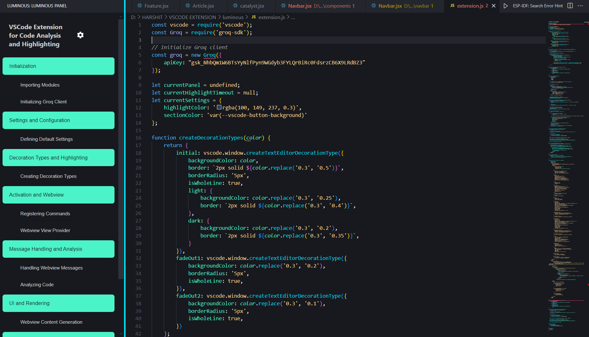
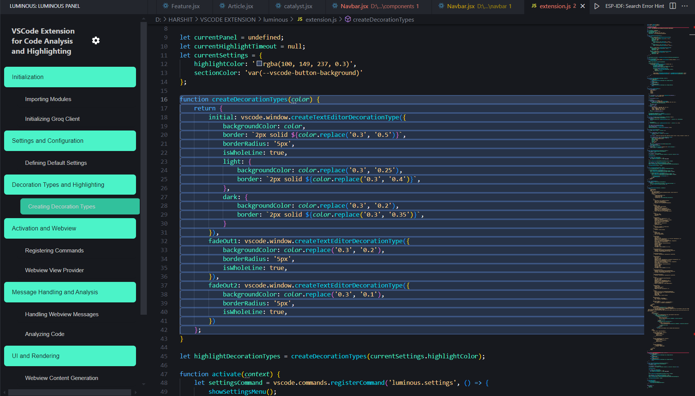
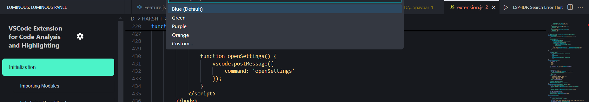
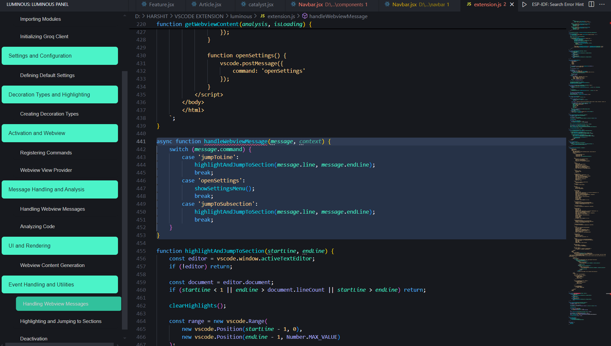

# ✨ Luminous - Smart Code Navigation & Analysis 🚀

> Navigate your codebase with AI-powered insights and beautiful animations! 🎯

[](https://code.visualstudio.com/)
[](https://opensource.org/licenses/MIT)


## 🌟 Features

### 🤖 AI-Powered Code Analysis
- Automatically analyzes your code structure
- Creates intuitive section breakdowns
- Understands code context and relationships



### 🎨 Beautiful Visual Experience
- Smooth highlight animations
- Elegant fade-out effects
- Modern, clean interface design
- Dark and light theme support



### 🎯 Smart Navigation
- Jump to any code section instantly
- Intelligent subsection detection
- Visual breadcrumbs for easy orientation

### 🎨 Customizable Highlights
- Choose from preset color themes
- Create custom color schemes
- Adjustable highlight animations



## 🚀 Installation

### Development Mode Installation

1. Clone the repository:
```bash
git clone https://github.com/yourusername/luminous.git
cd luminous
```

2. Install dependencies:
```bash
npm install
```

3. Open in VS Code:
```bash
code .
```

4. Launch the extension:
   - Press `F5` to start debugging
   - OR select `Run and Debug` from the sidebar (Ctrl+Shift+D)
   - Select `Extension` from the dropdown
   - Click the green play button or press `F5`

A new VS Code window will open with the extension loaded.

### Alternative Installation Methods

#### Using VSIX File
1. Build the VSIX package:
```bash
npm install -g @vscode/vsce
vsce package
```
2. Install the generated .vsix file:
   - Open VS Code
   - Go to Extensions (Ctrl+Shift+X)
   - Click the '...' menu (top-right)
   - Select 'Install from VSIX...'
   - Choose the generated .vsix file

## ⚙️ Configuration

Customize your experience through the settings menu:

- 🎨 Highlight Colors
  - Blue (Default)
  - Green
  - Purple
  - Orange
  - Custom RGBA colors



## 💡 Usage Tips

### Quick Navigation
Click any section in the sidebar to instantly jump to that part of your code. The intelligent highlighting system will guide your eyes to the right place!

### Subsections
Nested code blocks are automatically detected and can be navigated separately for precise code exploration.

### Settings Customization
Click the ⚙️ icon to access quick settings and personalize your Luminous experience.

## 🛠️ Technical Details
- Uses the Groq LLM API for intelligent code analysis
- Built with performance and responsiveness in mind
- Lightweight and optimized for VS Code

## 🤝 Contributing

Have ideas to make Luminous even better? Contributions are welcome!

1. Fork the repository
2. Create your feature branch
3. Submit a pull request

## 📝 License

This project is licensed under The Scaler School of Technology.

## 🌟 Support

If you like Luminous, please consider:
- ⭐ Starring the repository
- 🐛 Reporting any bugs you find
- 💡 Suggesting new features
- 📣 Spreading the word!

---

Made with ❤️ for developers who love clean, organized code.
